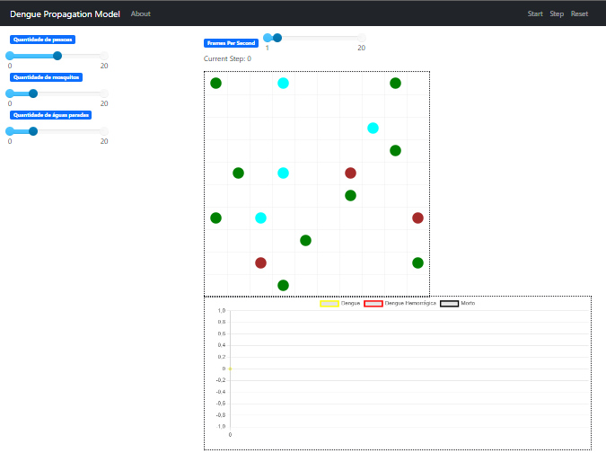

# 2024.1 Grupo 1 SMA Simulação de Dengue

**Disciplina**: FGA0210 - PARADIGMAS DE PROGRAMAÇÃO - T01 <br>
**Nro do Grupo (de acordo com a Planilha de Divisão dos Grupos)**: 01<br>
**Paradigma**: SMA<br>

## Alunos

|Matrícula | Aluno |
| -- | -- |
| 19/0023376 |   Abraão Alves Ribeiro |
| 19/0103302 |   Bernardo Chaves Pissutti |
| 19/0026600 |   Davi Marinho da Silva Campos | 
| 17/0161871 |   Denniel William Roriz Lima| 
| 19/0105267 |   Diógenes Dantas Lélis Júnior| 
| 18/0113321 |   Francisco Mizael Santos da Silva | 
| 23/2022952 |   Leonardo de Souza Takehana| 
| 19/0091720 |   Lucas Macedo Barboza |
| 19/0093196 |   Mateus Caltabiano Neves Frauzino| 
| 19/0094257 |   Paulo Henrique Rezende |
| 19/0047968 |   Paulo Vitor Silva Abi Acl 

## Sobre

O projeto visa demonstrar a propagação da dengue de maneira visual e utilizando o paradigma de Sistemas Multiagente (SMA). A simulação se inicia com uma quantidade pré-definidade de cada agente (Mosquito, Pessoa e Água parada), que pode ser configurada da maneira que o usuário desejar, entre 1 e 20 de cada agente. Na simulação, os agentes interagem entre si, sendo que os mosquitos podem infectar água parada e pessoas, as pessoas podem remover água parada e água infectada gera mais mosquitos.

## Screenshots


Página Inicial do Projeto

## Instalação

**Linguagens**: Python<br>
**Tecnologias**: Docker<br>

<!-- Descreva os pré-requisitos para rodar o seu projeto e os comandos necessários.
Insira um manual ou um script para auxiliar ainda mais.
Gifs animados e outras ilustrações são bem-vindos! -->

1. Instalar o Docker em https://docs.docker.com/get-docker/
2. Instalar o Docker compose em seu ambiente

### Linux

Para instalação no Linux siga as instruções da página https://docs.docker.com/desktop/install/linux-install/

### MacOS

Para instalação no MacOS siga as instruções da página https://docs.docker.com/desktop/install/mac-install/

### Windows

Para instalação no Windows siga as instruções da página https://docs.docker.com/desktop/install/windows-install/

3. Dê clone do projeto

```
git clone https://github.com/UnBParadigmas2024-1/2024.1_G1_SMA_Simulacao_Dengue/tree/main
```

4. Entre na pasta

```
cd 2024.1_G1_SMA_Simulacao_Dengue
```

5. Inicie o projeto

```
docker-compose up --build
```

Ou

```
docker compose up --build
```

6. Acessar Interface

Abra o navegador e acesse o `http://localhost:8521`

Obs: Para linux é necessário utilizar o comando sudo antes.

Caso as bibliotecas necessárias não tenham sido instaladas ao rodar `docker-compose --build`, pode ser neessário instalá-las separadamente. Para isso, basta rodar em seu terminal o seguinte comando.

```
pip install mesa numpy matplotlib
```

## Uso

Para utilizar o projeto, com a interface aberta no navegador, basta clicar no botão `start` do canto superior direito e a simulação se iniciará. 

O primeiro gráfico mostra o comportamento dos agentes e abaixo dele a quantidade de cada agente. 

Na parte superior ao centro da tela, é possível selecionar quantos frames se passarão a cada segundo, ou seja, é possível alterar a velocidade com que a simulação se passa na tela. 

E por fim, na esquerda, é possível configurar a quantidade inicial de cada agente.

<!-- Explique como usar seu projeto.
Procure ilustrar em passos, com apoio de telas do software, seja com base na interface gráfica, seja com base no terminal.
Nessa seção, deve-se revelar de forma clara sobre o funcionamento do software. -->

### Organização de tarefas

O grupo foi separado em quatro grupos menores para as atividades ficarem melhor organizadas. A divisão de tarefas entre cada subgrupo foi a seguinte:

- **Grupo 1**: Criar o Modelo de Contaminação;
- **Grupo 2**: Criação do Agente Pessoas;
- **Grupo 3**: Criação do Agente Mosquito
- **Grupo 4**: Criação do Objeto Água Parada;

## Vídeo

Adicione 1 ou mais vídeos com a execução do projeto.
Procure:
(i) Introduzir o projeto;
(ii) Mostrar passo a passo o código, explicando-o, e deixando claro o que é de terceiros, e o que é contribuição real da equipe;
(iii) Apresentar particularidades do Paradigma, da Linguagem, e das Tecnologias, e
(iV) Apresentar lições aprendidas, contribuições, pendências, e ideias para trabalhos futuros.
OBS: TODOS DEVEM PARTICIPAR, CONFERINDO PONTOS DE VISTA.
TEMPO: +/- 15min

## Participações

Apresente, brevemente, como cada membro do grupo contribuiu para o projeto.
|Nome do Membro | Contribuição | Significância da Contribuição para o Projeto (Excelente/Boa/Regular/Ruim/Nula) |
| -- | -- | -- |
| Abraão Alves | Ajuda na criação do Agente pessoas | Boa |
| Bernardo Chaves Pissutti | Ajudei a desenvolver o agente da água e as interações desse agente com os agentes do mosquito e da pessoa e a mostrar a evolução  da quantidade de mosquitos na simulação. | Boa |
| Davi Marinho da Silva Campos |  Ajudei na criação da ideia do projeto e das regras necessárias, também criei o código inicial dos agentes, a estrutura do projeto e o layout, e posteriormente ajudei nos agentes mosquito e pessoa e na finalização do projeto.  | Boa |
| Denniel William Roriz Lima | Estrutura do projeto, resolução de bugs e ajustes funções de step, movimentação, ajustes nas funções de PersonAgent, WaterObject e MosquitoAgent.
Significância da Contribuição para o Projeto | Excelente |
| Diógenes Dantas Lélis Júnior | Ajuda na criação do Modelo de Contaminação e ajustes no agente pessoa | Boa |
| Francisco Mizael Santos da Silva | | |
| Leonardo de Souza Takehana | Correção e edição de alguns bugs e melhoria do modelo, como a adição de probabilidades de progressão da doença, reprodução dos mosquitos e também criação de novas poças | Boa | 
| Lucas Macedo Barboza | Ajuda na criação do Agente pessoas, ajustes no agente mosquito. | Boa |
| Mateus Caltabiano Neves Frauzino | | |
| Paulo Henrique | Participei do desenvolvimento do agente mosquito, mais especificamente na intereção do mosquito com a pessoa, criei método que identifica se existe uma pessoa na mesma célula que o mosquito e desta forma infecta a pessoa e o mesmo checa se a pessoa está infectada para transmitir o vírus para a pessoa. | Boa |
| Paulo Vitor Silva Abi Acl | | |


## Outros

### Lições aprendidas
Durante o desenvolvimento deste projeto, aprendemos sobre a complexidade do paradigma SMA e como ele pode ser aplicado para modelar interações realistas entre agentes autônomos. Também percebemos a importância da colaboração e divisão de tarefas para gerenciar o tempo e entregar um projeto de qualidade.

### Percepções
O uso de MESA para modelagem baseada em agentes foi uma experiência enriquecedora, proporcionando uma nova perspectiva sobre simulações computacionais e como elas podem ser usadas para entender fenômenos do mundo real, como a propagação de doenças.

### Contribuições e Fragilidades
As contribuições foram significativas, especialmente na criação de modelos realistas para a propagação da dengue. No entanto, identificamos fragilidades no equilíbrio entre a complexidade da simulação e a clareza dos resultados apresentados. Futuras iterações podem focar em aprimorar essas áreas.

### Trabalhos Futuros
Para trabalhos futuros, consideramos a implementação de diferentes cenários de propagação, como variáveis climáticas que afetem a população de mosquitos e a inclusão de agentes de saúde pública que possam intervir na simulação. Além disso, melhorias na visualização e no desempenho da simulação são objetivos para versões subsequentes do projeto.

## Fontes

https://github.com/UnBParadigmas2023-1-Turma02/2023.1_G2_SMA_SimuladorDoenca
https://github.com/UnBParadigmas2023-2/2023.2_G4_SMA

Esse projeto se diferencia por incrementar a água parada que consegue ser tanto contaminada como também gerar mais mosquitos de forma probabilistica, ele possui diferenciação quando pica uma pessoa infectada ou não colocando chances da pessoa se curar e tempo de vida. Ele também corre por mais de um step ou seja a velocidade é maior que um humano também no modelo de simulação
